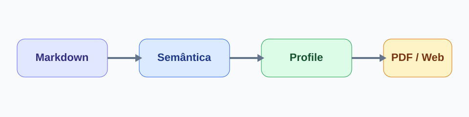

# Introdução

Um vault torna a relação entre fonte, referência e publicação rastreável
[@silva2024, p. 27]. Consulte também o [[../pesquisa/projeto.md|projeto de
pesquisa]] que organiza esta demonstração.

## Objetivo

Avaliar se um fluxo local diminui a perda de contexto entre coleta, escrita e
revisão, seguindo o princípio apresentado por @oliveira2025.

# Método

Figura: Pipeline de autoria e publicação

{#fig-pipeline width=82%}

Fonte: elaboração própria.

Tabela: Evidências observadas

| Indicador | Antes | Depois |
| --- | ---: | ---: |
| Referências sem nota | 12 | 2 |
| Tempo para localizar fonte | 18 min | 4 min |
| Erros de citação | 7 | 1 |

Fonte: dados fictícios da demonstração.

O cálculo de redução pode ser expresso por:

$$
redução = \frac{antes - depois}{antes}
$$
{#eq-reducao}

## Procedimento reproduzível

```ts
const publication = await compiler.compile({ prepared, environment });
```

O procedimento gera diagnóstico antes do preview e não altera o Markdown
autoral. A estratégia também dialoga com a noção de documentos como grafos
[@souza2023].

# Discussão

O resultado sintetizado na Tabela 1 indica que o ganho está em preservar o
contexto, não em esconder a fonte. Veja a equação {#eq-reducao} e a Figura
{#fig-pipeline} durante a revisão.

# Referências
