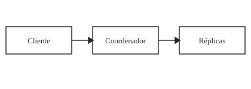

# Introdução

O modelo semântico separa significado de apresentação, como discute @silva2024.

# Resultados



Fonte: [@silva2024]

Tabela: Camadas da publicação

| Camada | Responsabilidade |
| --- | --- |
| Documento | Conteúdo e relações |
| Profile | Apresentação editorial |

Fonte: [@silva2024]

Código: Compilação orientada por profile

```ts
const publication = compile(resolved, profile);
```

# Conclusão

O mesmo conteúdo pode gerar artigos visualmente distintos sem alterar a AST.
